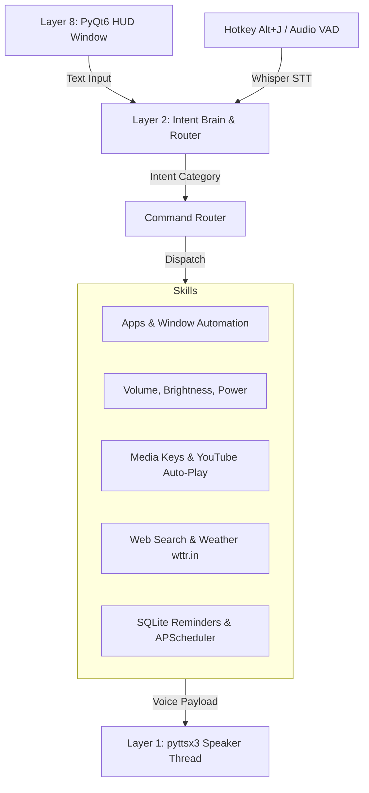

# J.A.R.V.I.S. — Just A Rather Very Intelligent System

[](https://www.microsoft.com/windows)
[](https://www.python.org/)
[](LICENSE)

J.A.R.V.I.S. is an advanced, natural-language desktop assistant designed exclusively for Windows. Inspired by the Stark Industries HUD from the Marvel Cinematic Universe, J.A.R.V.I.S. provides a central command layer on top of your operating system. Control your system, automate apps, search the web, manage media, and query a local AI brain using a combination of natural-language voice commands and keyboard input.

---

## 📖 Table of Contents
1. [Key Features](#-key-features)
2. [System Architecture](#-system-architecture)
3. [Prerequisites](#-prerequisites)
4. [Installation & Setup](#-installation--setup)
5. [Configuration](#%EF%B8%8F-configuration)
6. [Usage & Controls](#-usage--controls)
7. [Voice Command Reference](#-voice-command-reference)
8. [Troubleshooting](#-troubleshooting)

---

## 🌟 Key Features

*   **🎙️ Voice Pipeline (Offline & Local)**:
    *   Energy-based Voice Activity Detection (VAD) with auto-silence detection.
    *   Offline, high-accuracy Speech-to-Text (STT) utilizing **OpenAI Whisper (base)**.
    *   Calm, deep-voice Text-to-Speech (TTS) utilizing **pyttsx3 (SAPI5)** with Windows thread synchronization.
*   **🖥️ Frameless HUD overlay (PyQt6)**:
    *   Glassmorphic, transparent design that stays on top.
    *   Animated Arc Reactor status indicator (Idle, Listening, Processing, Speaking, Error).
    *   Real-time system stats (CPU, RAM, Disk) with circular ring gauges.
    *   Integrated bottom-bar text input field and `SEND` button.
*   **🧠 Local AI Integration (Qwen 2.5 Coder)**:
    *   Runs 100% locally and offline via **Ollama**.
    *   Multi-turn conversational chat with context-preserving session memory.
    *   Assists in writing, rephrasing, code generation, and error debugging.
*   **⚙️ Deep Windows System Control**:
    *   App controls (Launch, Switch to, Close/Kill) using fuzzy matching (`fuzzywuzzy`) and Windows Registry resolution (`App Paths`).
    *   Window snapping (Maximize, Minimize, Left/Right Snap, Restore) via Win32 API.
    *   System volume and screen brightness adjustments.
    *   Security locks, sleep, restart, and shutdown with safety confirmations.
*   **🎵 Media & YouTube Auto-Playback**:
    *   Failsafe media keys injection.
    *   Auto-starts Spotify or falls back to browser YouTube Music when inactive.
    *   Parses direct play songs (e.g. `"play Bohemian Rhapsody"`) and automatically starts playing the first result instead of showing lists.
*   **⏰ Reminders & Timers**:
    *   SQLite-backed background reminder scheduler.
    *   Supports relative parsing (e.g., `"remind me in 30 minutes to check the build"`).
    *Cross-platform Windows toast notifications and voice callouts.

---

## 🏗️ System Architecture

J.A.R.V.I.S. is structured in decoupled, module-based layers:



*   **Layer 0: Foundation**: Loads configurations (`settings.yaml` + `.env`), directories, and establishes global logging.
*   **Layer 1: Voice Pipeline**: Controls mic-recording buffers and SAPI5 speaking queues.
*   **Layer 2: Core Brain**: Parses phrasings against 80+ pre-compiled priority regex patterns, falling back to local Qwen 2.5 Coder for natural language queries.
*   **Layer 3–7: Skill Layers**: Local system integrations (Win32, comtypes, sqlite3, requests).
*   **Layer 8: UI HUD**: PyQt6 GUI loop running on the main thread, utilizing signals to update gauges and trigger states.

---

## 📋 Prerequisites

J.A.R.V.I.S. runs entirely locally. Ensure your system meets these requirements:

1.  **OS**: Windows 10 or Windows 11 (x64).
2.  **Python**: Python 3.8 to 3.14.
3.  **Local LLM Engine**: [Ollama](https://ollama.com/) running on `http://localhost:11434`.
    *   Download the model: `ollama pull qwen2.5-coder:7b` (or `3b` for lower-end machines).
4.  **Hardware**: An NVIDIA GPU with at least 4GB VRAM is highly recommended to accelerate the STT (Whisper) and LLM (Qwen) components.

---

## 🚀 Installation & Setup

1.  **Clone the Repository**:
    ```bash
    git clone https://github.com/yourusername/jarvis-v1.git
    cd jarvis-v1
    ```

2.  **Set Up Virtual Environment** (Optional but recommended):
    ```bash
    python -m venv venv
    venv\Scripts\activate
    ```

3.  **Install Dependencies**:
    ```bash
    pip install -r requirements.txt
    ```

4.  **Configure Environment Variables**:
    *   Copy the example file: `copy .env.example .env`
    *   Open `.env` and fill in API keys if you want to use weather, news, or exchange rate modules:
        ```ini
        WEATHER_API_KEY=your_openweathermap_key
        NEWS_API_KEY=your_newsapi_key
        EXCHANGE_API_KEY=your_exchangerate_key
        ```

5.  **Verify Module Imports**:
    Run the pre-flight verification script to ensure all compiled libraries and DLL dependencies load correctly:
    ```bash
    python test_imports.py
    ```

---

## ⚙️ Configuration

Settings can be edited inside `config/settings.yaml` or customized directly within the HUD's gear settings window:

```yaml
user:
  name: "Sir"                # How JARVIS addresses you
  first_boot: false          # Skip intro greeting after first run

voice:
  enabled: true              # Toggle voice output
  speed: 175                 # TTS speed (words per minute)
  volume: 0.9                # TTS volume (0.0 to 1.0)
  whisper_model: "base"      # tiny | base | small | medium

activation:
  hotkey: "alt+j"            # Trigger voice command
  text_hotkey: "ctrl+space"  # Focus text box input
```

---

## ⌨️ Usage & Controls

### Startup
Start the application from your terminal:
```bash
python main.py
```
Upon startup, the Arc Reactor will spin up, staggered HUD panels will fade in, and JARVIS will speak the boot greeting: *"All systems online. J.A.R.V.I.S. is ready, Sir."*

### Activating Commands
1.  **Voice Mode**: Press **`Alt + J`** (configurable) on your keyboard. Speak your command when the reactor glows green and displays `LISTENING`.
2.  **HUD Text Mode**: Click on the bottom command bar, type your command, and press **`Enter`** (or click `SEND`).
3.  **Terminal Mode**: Alternatively, type commands directly into the running command line shell.

---

## 🗣️ Voice Command Reference

| Intent Category | Sample Phrases | Expected Action |
| :--- | :--- | :--- |
| **Website Launch** | `"open youtube"`, `"visit github.com"` | Opens default browser directly to target URL. |
| **App Launch** | `"open chrome"`, `"launch notepad"` | Resolves path via Registry App Paths and launches the application. |
| **Song Playback** | `"play Bohemian Rhapsody"`, `"play perfect"` | Scrapes YouTube, retrieves first video ID, and auto-plays song directly. |
| **Failsafe Music** | `"play music"` | Simulates hardware keys, falls back to Spotify, or starts YouTube Music. |
| **Window Snapping** | `"snap window left"`, `"maximize window"` | Snap/resizes foreground window. |
| **System Info** | `"what is my cpu usage"`, `"system status"` | Live update display gauges + voice readout. |
| **Volume Control** | `"mute"`, `"volume up"`, `"set volume to 80"` | Adjusts Windows main mixer level.|
| **Reminders** | `"remind me in 10 minutes to take a break"` | Schedules SQLite reminder + fires Windows toast + voice alert. |
| **Timers** | `"set a timer for 5 minutes"` | Starts background timer visible in HUD. |
| **Power Control** | `"shut down"`, `"reboot"` | Locks PC or schedules restart with voice confirmation flow. |
| **AI Assitance** | `"write a python function to scrape a site"` | Opens code window in HUD and generates code using Qwen. |
| **AI Conversational**| `"let's talk"`, `"end conversation"` | Switch between direct command mode and conversational context mode. |

---

## 🛠️ Troubleshooting

#### 1. Cannot find module `pyttsx3` or PyQt6
Ensure you are launching the application using the same Python interpreter where the requirements are installed. Run `pip list` to check, or reinstall using `python -m pip install -r requirements.txt`.

#### 2. TTS Voice hangs or keeps running indefinitely
COM objects must be initialized in secondary threads. JARVIS calls `pythoncom.CoInitialize()` at the startup of the speaker thread to prevent voice locking. If issues persist, verify that your default audio playback device is properly connected and active.

#### 3. Ollama / Qwen AI commands timeout
Verify that the Ollama application is active in your system tray and that you have pulled the model (`ollama run qwen2.5-coder:7b`). For slower hardware, try upgrading your GPU drivers or switching to a lighter model (`3b` or `1.5b`) in the settings panel.

---
*Developed with ❤️ as a local Windows companion. Just A Rather Very Intelligent System.*
